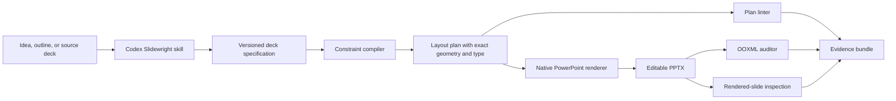

# Architecture

Slidewright separates probabilistic content/design reasoning from deterministic formatting mechanics.

## Components

### 1. Codex plugin and skill

The skill gathers the communication job, content hierarchy, source constraints, and visual direction. It creates the deck specification and runs the deterministic pipeline. Detailed rules live in references; fragile mechanics live in scripts.

### 2. Deck specification

A JSON document owns semantic intent: slide purpose, content, emphasis runs, layout family, and theme tokens. It does not contain arbitrary x/y coordinates. This boundary makes reasoning inspectable and keeps layout mechanics testable.

### 3. Constraint compiler

The compiler maps semantic slots to a fixed canvas, margin frame, grid, and typography budget. It selects the largest permitted point size that fits, records estimated line usage, and rejects unsatisfied constraints instead of silently shrinking below the quality bar.

### 4. Linter

The linter checks canvas bounds, margin symmetry, padding symmetry, typography scale, fit status, editability intent, and supported rich-text runs. Diagnostics have stable rule IDs so they can be evaluated over time.

### 5. Native renderer

The renderer uses OpenAI's bundled presentation artifact runtime to create native PowerPoint text boxes and shapes. Renderer adapters are deliberately isolated so a future Office.js or Open XML adapter can implement the same plan contract.

### 6. Export auditor

The Python auditor opens the `.pptx` as OOXML and verifies native text nodes, whole-point font sizes, and bold/regular run preservation. It catches regressions that a plan-only test cannot see.

## Trust boundaries

- Model-authored content may be incomplete or too dense; the compiler never assumes it fits.
- Renderer output may differ from the plan; the OOXML and render passes verify the artifact.
- A template may contain licensed or proprietary assets; fixtures must be owned, licensed, or synthetic.
- External facts used in a deck require source provenance; Slidewright does not invent evidence.

## Extension path

1. Add more layout families behind the same plan schema.
2. Import an existing PPTX and infer its design tokens.
3. Use golden-file comparisons to preserve template geometry and typography.
4. Add an interactive repair loop that proposes content shortening or alternate layouts.
5. Add an MCP service only when remote asset, template, or organization policy access is needed.
